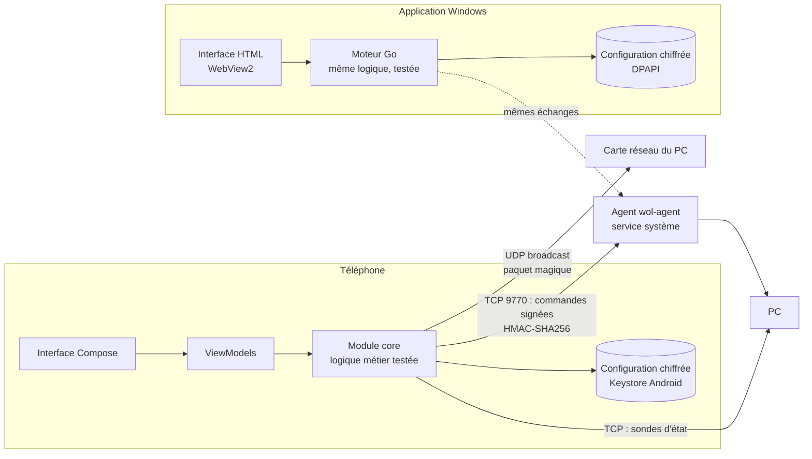

# Wake On LAN

Application Android **et Windows** pour **démarrer, surveiller et éteindre vos PC** sur le réseau local,
depuis votre téléphone ou depuis un autre PC.

- ⚡ **Démarrage** des PC par Wake-on-LAN (paquet magique), fiabilisé (envois répétés, bonne adresse de diffusion, bon réseau).
- 🟢 **État en temps réel** de chaque PC : allumé / éteint / en cours de démarrage / en cours d'arrêt, avec latence et « vu il y a… ».
- 📈 **Latence en direct façon électrocardiogramme** : sur la fiche d'un PC, la valeur actuelle et le tracé de la dernière
  minute (une mesure par seconde), avec min / moyenne / max et sondes restées sans réponse ; mini-tracés dans les listes.
- ⏻ **Extinction, redémarrage et mise en veille à distance** grâce à un petit agent à installer sur les PC (Windows, Linux, macOS).
- 🕘 **Historique discret** des démarrages et extinctions sur 30 jours (complet grâce au journal de l'agent, même quand
  l'application était fermée).
- 🌙 **Style sombre et moderne**, identique sur Android et Windows : synthèse en anneau, plan du réseau, fiche de chaque PC.
- 🤝 **Partage des PC** avec les personnes de votre choix, PC par PC (démarrer seulement, ou aussi éteindre) :
  invitation par QR code ou lien, accès chiffré pour le seul appareil de la personne et signé par vous, mis à jour
  automatiquement, retirable à tout moment ([docs/PARTAGE.md](docs/PARTAGE.md)).
- 🔄 **Mises à jour intégrées** : les applications proposent les nouvelles versions avec leurs nouveautés et s'installent
  en un clic, sans toucher aux PC enregistrés ni à l'historique ([docs/MISES-A-JOUR.md](docs/MISES-A-JOUR.md)).
- 🔒 **Sécurisée** : configuration chiffrée sur le téléphone, commandes authentifiées et non rejouables, aucune donnée
  personnelle envoyée sur Internet en clair (GitHub n'est contacté que pour la recherche de mises à jour, désactivable,
  et pour le partage si vous l'utilisez : uniquement des fichiers chiffrés).
- 💾 **Export / import** de la configuration (fichier chiffré par mot de passe si les clés sont incluses).
- 📷 **Appairage par QR code** : l'agent affiche un QR code, l'application remplit tout (IP, MAC, clé).
- 🖥️ **Application Windows** très légère (un seul `.exe` d'environ 8 Mo, sans installation) : mêmes fonctions et même
  style, sauvegardes interchangeables avec le téléphone.

Conçue pour Android 8 à Android 17 (testée pour le Pixel 8a, prête pour les versions suivantes) et Windows 10 / 11.

---

## Sommaire

1. [Installer l'application sur le téléphone](#1-installer-lapplication-sur-le-téléphone)
2. [Installer l'application Windows](#2-installer-lapplication-windows)
3. [Préparer les PC pour le Wake-on-LAN](#3-préparer-les-pc-pour-le-wake-on-lan)
4. [Installer l'agent (extinction à distance)](#4-installer-lagent-extinction-à-distance)
5. [Utilisation](#5-utilisation)
6. [Comment ça marche](#6-comment-ça-marche)
7. [Sécurité](#7-sécurité)
8. [Développement](#8-développement)
9. [Pistes d'amélioration](#9-pistes-damélioration)
10. [Dépannage](#10-dépannage)

---

## 1. Installer l'application sur le téléphone

L'APK est produit automatiquement par GitHub à chaque modification du code.

1. Sur le téléphone, ouvrez la page **[Releases](https://github.com/slaynAW/WakeOnLan/releases)** du dépôt.
   - `dev` : dernière version de développement ;
   - `vX.Y.Z` : versions officielles.
2. Téléchargez **`WakeOnLan-….apk`**.
3. Ouvrez le fichier. Android demande d'**autoriser l'installation depuis le navigateur** : acceptez (une seule fois).
4. Au premier lancement sous Android 17, acceptez l'autorisation **« Appareils à proximité / réseau local »** : sans elle, Android bloque tout accès au réseau local.

> **Mises à jour** : à partir de la version 1.2.0, l'application les propose elle-même (*Mettre à jour*, voir
> [docs/MISES-A-JOUR.md](docs/MISES-A-JOUR.md)). On peut aussi installer le nouvel APK par-dessus l'ancien. Cela fonctionne tant que les APK sont signés avec la même clé :
> configurez une fois la clé de signature en suivant **[docs/SIGNATURE.md](docs/SIGNATURE.md)** (5 minutes). Sans cette étape, chaque build
> est signé avec une clé temporaire et il faut désinstaller avant de réinstaller (pensez à exporter la configuration).

## 2. Installer l'application Windows

Pour démarrer et surveiller vos PC depuis un autre PC (Windows 10 / 11, x64 ou ARM).

1. Dans les **[Releases](https://github.com/slaynAW/WakeOnLan/releases)**, téléchargez **`WakeOnLan-Windows-….-x64.exe`**
   (`-arm64.exe` pour un PC ARM).
2. Double-cliquez dessus : aucune installation. Si SmartScreen s'affiche : *Informations complémentaires* → *Exécuter quand même*.
3. Récupérez vos PC **depuis le téléphone** : sur le téléphone, *Réglages* → *Exporter la configuration* (complète, avec mot de passe),
   puis sur le PC *Réglages* → *Importer une configuration* (ou glissez le fichier dans la fenêtre).
   Vous pouvez aussi ajouter un PC en collant le lien affiché par `wol-agent pair`, ou le saisir à la main.

La configuration est chiffrée pour votre session Windows (DPAPI). Détails : **[desktop/README.md](desktop/README.md)**.

## 3. Préparer les PC pour le Wake-on-LAN

Le Wake-on-LAN est une fonction de la **carte réseau filaire** : le PC doit être branché en **Ethernet**
(le réveil par Wi-Fi n'est quasiment jamais pris en charge). Trois réglages sont nécessaires :

| Où | Réglage |
|---|---|
| **BIOS / UEFI** | Activer *Wake on LAN*, *Power On By PCI-E*, *Resume by LAN*… (le nom varie selon la carte mère). Désactiver *ErP / EuP Ready* / *Deep Sleep*. |
| **Windows – carte réseau** | Gestionnaire de périphériques → carte Ethernet → *Gestion de l'alimentation* : cocher « Autoriser ce périphérique à sortir l'ordinateur du mode veille » et « N'autoriser que le paquet magique ». Onglet *Avancé* : *Wake on Magic Packet* = Activé. |
| **Windows – démarrage rapide** | Panneau de configuration → Options d'alimentation → « Choisir l'action des boutons » → décocher **Activer le démarrage rapide** (sinon le réveil depuis l'état « éteint » échoue souvent). |
| **Linux** | `sudo ethtool -s eth0 wol g` (remplacez `eth0`) ; pour le rendre permanent : `nmcli connection modify "<connexion>" 802-3-ethernet.wake-on-lan magic`. |

Dans votre box / routeur, **réservez l'adresse IP** de chaque PC (bail DHCP statique) : l'état en temps réel et l'agent utilisent cette adresse.

Guide détaillé : **[docs/CONFIGURER-LES-PC.md](docs/CONFIGURER-LES-PC.md)**.

## 4. Installer l'agent (extinction à distance)

L'agent est **facultatif** : il n'est nécessaire que pour éteindre / redémarrer / mettre en veille à distance.
Il rend aussi l'indicateur d'état **plus fiable** (il répond même quand le pare-feu bloque le ping).

Les binaires sont publiés avec l'APK dans les **[Releases](https://github.com/slaynAW/WakeOnLan/releases)**.

**Windows** (10 / 11)
1. Téléchargez `wol-agent-windows-amd64.exe` (ou `arm64` pour les PC ARM).
2. Double-cliquez dessus. Si SmartScreen s'affiche : *Informations complémentaires* → *Exécuter quand même*.
3. Acceptez l'invite administrateur : l'agent s'installe comme **service Windows** (démarrage automatique, relance en cas de problème) et ouvre le port 9770 **uniquement pour le réseau local** dans le pare-feu.
4. Un **QR code** s'affiche : sur le téléphone, *Ajouter un PC* → *Scanner le QR code*. C'est tout.
   (Application Windows : *Ajouter un PC* → *Coller le lien*, avec le lien `wolagent://…` affiché sous le QR code.)

**Linux** (systemd)
```bash
chmod +x wol-agent-linux-amd64
sudo ./wol-agent-linux-amd64 install     # installe dans /usr/local/bin + service systemd, affiche le QR code
```

**macOS**
```bash
chmod +x wol-agent-darwin-arm64
sudo ./wol-agent-darwin-arm64 install
```

Sous Windows, l'agent (1.4.0 ou plus) propose lui-même ses nouvelles versions à l'utilisateur du PC et s'installe
après son accord, sans changer la clé.

Commandes utiles : `wol-agent pair` (réafficher le QR code), `wol-agent status`, `wol-agent rotate-key` (changer la clé),
`wol-agent update` (mettre à jour), `wol-agent uninstall`. Détails : **[agent/README.md](agent/README.md)**.

## 5. Utilisation

- **Vue d'ensemble** : anneau de synthèse (allumés, en cours, éteints, inconnus) et un voyant par PC — 🟢 allumé, 🔴 éteint,
  🟠 (clignotant) démarrage / arrêt en cours, ⚪ inconnu (par exemple quand le téléphone n'est pas sur le Wi-Fi : l'application
  préfère « inconnu » à un faux « éteint »). Sur Windows, un **plan du réseau** relie chaque PC selon son état.
- **Démarrer** : envoie le paquet magique ; le voyant passe en « Démarrage en cours… » avec un chronomètre, puis au vert dès que le PC répond.
- **Éteindre / Redémarrer / Veille** : depuis la fiche du PC, le menu ⋯ ou le bouton de la liste (confirmation demandée,
  option « Forcer la fermeture des applications »).
- **Fiche d'un PC** : état, actions, **latence en direct** (valeur et tracé défilant de la dernière minute : le PC affiché
  est vérifié chaque seconde ; les traits rouges marquent les sondes sans réponse), adresse IP / MAC, système,
  « allumé depuis », agent, et un **historique discret**
  des derniers évènements (*Tout afficher* : 30 jours, groupés par jour). « ≈ » signale une heure constatée par
  l'application (à quelques secondes près) plutôt que relevée par l'agent ; « arrêt inattendu » : coupure de courant,
  arrêt forcé ou plantage. Avec l'agent 1.4.0, l'historique est **commun** au téléphone et au PC Windows : chaque demande
  (démarrage, extinction…) y figure avec l'appareil qui l'a faite (« par Pixel 8 »).
- **Ajouter un PC** : QR code de l'agent, lien collé, ou saisie manuelle (nom + adresse MAC suffisent pour le démarrage ; ajoutez l'IP pour l'état en temps réel).
- **Réglages** : fréquence de vérification (3 s par défaut), délai d'attente du démarrage, confirmation, **partage**
  (*Partager mes PC*, *PC partagés avec moi*), **export / import** (la sauvegarde complète contient aussi l'historique,
  ajouté à celui de l'appareil qui l'importe), historique (affichage complet, effacement).
- **Partage** : *Partager mes PC* → connexion GitHub (une fois) → *Inviter une personne* ; elle *Demande un accès* et vous
  renvoie sa demande ; vous comparez le code de vérification puis choisissez ses PC et ses droits. Guide :
  [docs/PARTAGE.md](docs/PARTAGE.md).
- **Windows** : mêmes fonctions en grand écran (plan du réseau, tableau des appareils, panneau de détail) ; **F5** actualise,
  un fichier de sauvegarde glissé dans la fenêtre est importé.

## 6. Comment ça marche



- **Réveil** : le paquet magique (6 × `FF` + 16 × l'adresse MAC) est envoyé 3 fois sur l'adresse de diffusion du sous-réseau **et** sur `255.255.255.255`, en forçant l'utilisation du Wi-Fi (même si Android préfère les données mobiles quand le Wi-Fi n'a pas Internet).
- **État en temps réel** : toutes les 3 s (1 s pendant un démarrage / arrêt), plusieurs sondes sont lancées en parallèle : agent (authentifié), connexion TCP à des ports courants (une connexion *refusée* prouve aussi que le PC est allumé) et ping. Une machine à états avec **hystérésis** évite les faux « éteint » (2 échecs consécutifs requis). La surveillance s'arrête quand l'application n'est pas à l'écran (pas de consommation de batterie).
- **Extinction** : l'agent reçoit une commande signée, répond, puis lance l'arrêt complet du système.
- **Historique** : l'agent tient un journal local de 30 jours (démarrages, arrêts, veille, commandes reçues) que les
  applications relisent ; elles y ajoutent leurs propres demandes et les changements qu'elles constatent.

L'application Windows reprend exactement la même logique (réécrite en Go, avec les mêmes tests) et le même format
de sauvegarde : des fichiers de référence produits par un outil indépendant sont relus par les tests des deux applications.

Détails : **[docs/ARCHITECTURE.md](docs/ARCHITECTURE.md)** et **[docs/PROTOCOLE.md](docs/PROTOCOLE.md)**.

## 7. Sécurité

| Menace | Protection |
|---|---|
| Vol / analyse du téléphone | Configuration chiffrée AES-256-GCM avec une clé du **Keystore Android** (matériel sécurisé, non exportable) ; sauvegarde cloud Android désactivée. |
| Copie de la configuration sur le PC Windows | Fichier chiffré par **DPAPI** (lié à la session Windows) : illisible depuis un autre compte ou un autre PC. L'historique est chiffré de la même façon sur les deux applications. |
| Quelqu'un sur le réseau envoie une fausse commande | Chaque commande est signée **HMAC-SHA256** avec une clé de 256 bits propre à chaque PC ; la clé ne circule jamais. |
| Rejeu d'une commande capturée | Défi aléatoire (nonce) à chaque connexion : une signature n'est valable qu'une fois. |
| Faux agent qui ment sur l'état | Les réponses de l'agent sont elles aussi signées (authentification mutuelle). |
| Force brute sur la clé | Blocage de 5 min après 5 échecs ; clé de 256 bits (irréaliste à deviner). |
| Accès depuis Internet | L'agent n'accepte que les adresses privées ; pare-feu Windows limité au sous-réseau local. |
| Fuite d'une sauvegarde | Export complet chiffré par mot de passe (PBKDF2 600 000 itérations + AES-256-GCM) ; export « sans clés » sinon. |
| Partage des PC | Accès chiffré pour la clé d'un seul appareil (ECDH P-256 + AES-256-GCM) et signé par la personne qui partage (ECDSA P-256) ; code de vérification ; aucun accès aux dépôts GitHub ([docs/PARTAGE.md](docs/PARTAGE.md)). |
| APK modifié | Signature de l'APK avec une clé privée stockée uniquement dans les secrets GitHub ; somme de contrôle de Gradle vérifiée. |

Détails et limites : **[docs/SECURITE.md](docs/SECURITE.md)**.

## 8. Développement

```
├── app/        Application Android (Kotlin, Jetpack Compose, Material 3)
├── core/       Logique métier en Kotlin pur, testée sur la JVM (paquet magique, protocole, états…)
├── desktop/    Application Windows en Go + WebView2 (interface HTML au même style que l'app Android)
├── agent/      Agent PC en Go (binaire unique, sans dépendance)
├── protocol/   Vecteurs de test partagés (protocole, paquet magique, sauvegardes, historique)
├── docs/       Documentation
└── .github/    CI/CD GitHub Actions
```

| Commande | Rôle |
|---|---|
| `./gradlew :core:test` | Tests unitaires de la logique métier |
| `./gradlew :app:assembleRelease` | APK (nécessite le SDK Android, API 37) |
| `./gradlew :app:lintRelease` | Analyse statique Android |
| `cd agent && go test ./...` | Tests de l'agent |
| `cd agent && go build .` | Agent pour le système courant |
| `cd desktop && go test ./...` | Tests de l'application Windows |
| `cd desktop && go run .` | Application Windows en mode développement (navigateur, sous Linux / macOS) |

Versions : AGP 9.4, Kotlin 2.4, Gradle 9.7, compileSdk/targetSdk 37, minSdk 26, Go 1.26.
Publier une version officielle : onglet **Actions → Build → Run workflow**, branche `main`, champ
« Version officielle à publier » (ex. `1.2.0`). La CI crée le tag `v1.2.0` et la Release avec l'APK et les agents
(pousser un tag `vX.Y.Z` fonctionne aussi). Sans numéro, le build met simplement à jour la pré-version `dev`.
Chaque Release contient l'APK, l'application Windows (x64 et ARM64) et les agents.

## 9. Pistes d'amélioration

Voir **[docs/AMELIORATIONS.md](docs/AMELIORATIONS.md)** : accès à distance via VPN (WireGuard/Tailscale) ou relais, widget d'écran d'accueil,
tuile de réglages rapides, raccourcis, notifications, verrouillage biométrique, découverte automatique des PC, planification, groupes…

## 10. Dépannage

| Symptôme | Piste |
|---|---|
| Le PC ne démarre pas | Vérifier BIOS/UEFI, carte réseau et démarrage rapide (§3). Le PC doit être en Ethernet. Tester depuis l'état « veille » d'abord. |
| Le voyant reste gris « pas de réseau local » | Le téléphone n'est pas sur le Wi-Fi (ou l'autorisation réseau local d'Android 17 est refusée : bannière en haut de l'écran). |
| Le voyant est rouge alors que le PC est allumé | Sans agent, Windows bloque souvent le ping : installez l'agent, ou ajoutez un port ouvert (RDP 3389, SMB 445…) dans *Options avancées*. |
| « agent arrêté sur le PC » | Le PC répond mais le service ne tourne pas : `wol-agent status`, ou relancez l'installation. |
| « clé refusée par l'agent » | La clé a changé (`rotate-key`) : ré-appairez avec `wol-agent pair`. |
| Historique : « Mettez à jour l'agent de ce PC… » | L'agent est antérieur à la version 1.2 : relancez l'installation avec la nouvelle version (configuration et clé conservées). |
| Mise à jour de l'APK refusée | Signature différente : voir [docs/SIGNATURE.md](docs/SIGNATURE.md). |
| Windows : « composant WebView2 introuvable » | Rare (Windows 10 non à jour) : acceptez l'ouverture de la page Microsoft et installez le composant. |
| Windows : un PC reste « État inconnu · pas de réseau local » | Ce PC n'a ni carte Ethernet ni Wi-Fi connectée (les cartes de machines virtuelles sont ignorées). |
