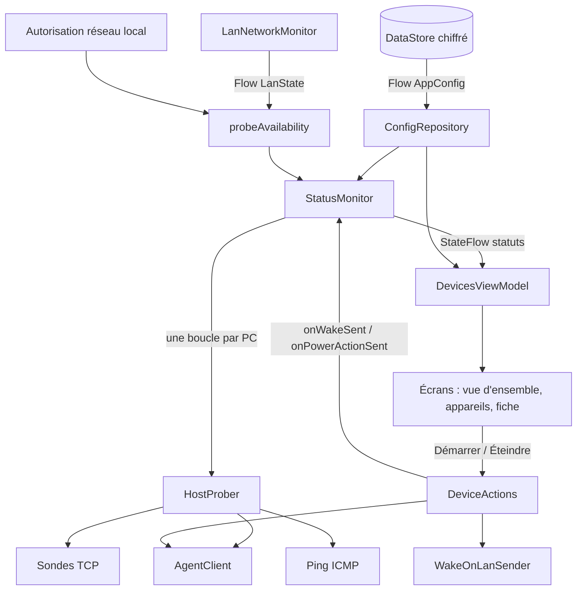
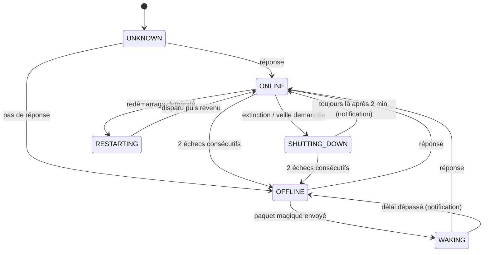
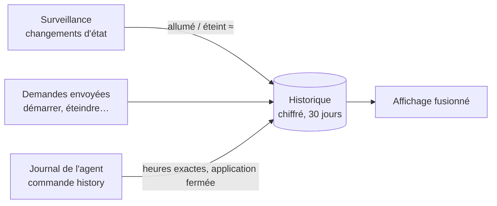
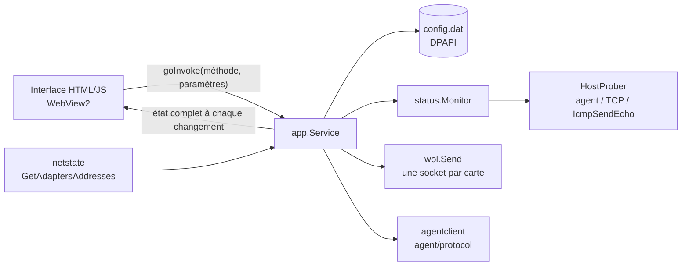

# Architecture

## Vue d'ensemble

```
WakeOnLan/
├── core/        Kotlin pur (JVM) — toute la logique métier, testée sans Android
│   ├── model/      Device, AppConfig, MacAddress, validation
│   ├── wol/        paquet magique, adresses de diffusion, envoi UDP
│   ├── status/     sondes (agent / TCP / ping), machine à états, surveillance
│   ├── agent/      protocole wolagent/1, client, clé, lien d'appairage
│   ├── history/    historique sur 30 jours : fusion avec le journal des agents, déduction des changements
│   ├── config/     JSON versionné + migrations, export/import chiffré
│   └── net/        attachement des sockets au bon réseau, E/S annulables
├── app/         Android — interface et intégration système
│   ├── data/       stockage chiffré (DataStore + Keystore) : configuration, historique
│   ├── network/    suivi du Wi-Fi/Ethernet, autorisation « réseau local »
│   ├── ui/         écrans Compose : onglets (vue d'ensemble, appareils, réglages), fiche d'un PC,
│   │               historique, édition ; thème sombre commun avec Windows
│   ├── AppContainer.kt    assemblage des dépendances (injection manuelle)
│   ├── DeviceActions.kt   réveil / extinction / test d'agent
│   └── HistoryTracker.kt  tenue de l'historique (surveillance, demandes, journal des agents)
├── desktop/     Go + WebView2 — application Windows (même interface et mêmes fonctions qu'Android)
│   ├── ui/         interface HTML/CSS/JS : plan du réseau, tableau, panneau de détail, historique
│   └── internal/   model, config (DPAPI, export), history, wol, agentclient, status, netstate, pairing, app
├── agent/       Go — service installé sur les PC
│   ├── protocol/   protocole partagé avec l'application Windows
│   └── internal/   server, config, history (journal 30 jours), power, service, pairing, netinfo, sysinfo, terminal
└── protocol/    vecteurs de test communs Kotlin ↔ Go (protocole, paquet magique, sauvegardes, historique)
```

**Pourquoi un module `core` séparé ?** Tout ce qui peut se tromper (calculs réseau, cryptographie, protocole, logique d'état)
y est isolé et couvert par des tests rapides (JUnit, sans émulateur). L'application Android se limite à l'affichage et à
l'intégration avec le système. C'est aussi ce qui rend le projet **évolutif** : une future version iOS / desktop (Kotlin
Multiplatform) ou un relais pourront réutiliser `core`.

## Flux de données



- Architecture **unidirectionnelle** : les écrans observent des `StateFlow` et envoient des intentions aux ViewModels.
- La surveillance (`StatusMonitor.run`) est liée au cycle de vie de l'activité (`repeatOnLifecycle(STARTED)`) :
  elle s'arrête dès que l'application n'est plus visible.

## Détection d'état en temps réel

Pour chaque PC, une boucle :

1. Si le téléphone ne peut pas vérifier (pas de Wi-Fi/Ethernet ni VPN, autorisation refusée, pas d'adresse) → **UNKNOWN** avec la raison.
2. Sinon, `HostProber` lance **en parallèle**, avec un délai global de 1,5 s :
   - l'**agent** (échange authentifié : nom, système, uptime) ;
   - des **connexions TCP** vers des ports courants (3389 RDP, 445 SMB, 22 SSH, 139 NetBIOS, configurables) :
     une connexion acceptée **ou refusée** (RST) prouve que la machine est allumée ; une machine éteinte ne répond pas ;
   - un **ping** ICMP.
3. `StatusTracker` (machine à états pure, testée) transforme le résultat :



4. Attente : intervalle réglable (3 s par défaut), **1 s** pendant les transitions, ou immédiatement après une action / un
   changement de réseau (canal de rafraîchissement).

## Envoi du paquet magique

- Destinations : adresse de diffusion forcée (si configurée) + diffusion dirigée de chaque sous-réseau du téléphone
  (ex. `192.168.1.255`, calculée depuis les `LinkProperties`) + `255.255.255.255`.
- 3 envois espacés de 120 ms vers chaque destination, sur le port configuré (9 par défaut).
- La socket est attachée au réseau Wi-Fi/Ethernet (`Network.bindSocket`) : si le Wi-Fi n'a pas d'accès Internet, Android
  route sinon le trafic vers les données mobiles.

## Historique des démarrages et extinctions (30 jours)



- **Agent** : `internal/history` tient `history.json` (à côté de `config.json`) : démarrage (heure réelle calculée depuis
  l'uptime, identifiant de démarrage du système pour ne pas compter deux fois un redémarrage du service), arrêt propre
  (arrêt du système signalé au service), **arrêt non enregistré** (coupure de courant, arrêt forcé : daté du dernier
  signe de vie, écrit chaque minute dans `alive.json`), veille / sortie de veille (écart entre horloge monotone et
  horloge incluant la veille), commandes reçues avec l'adresse de l'appareil qui les a envoyées.
- **Applications** : elles notent leurs propres demandes et les changements constatés par la surveillance (heure
  approximative, « ≈ »), relisent le journal de l'agent dès que le PC répond (au plus toutes les 5 minutes), et fusionnent
  les deux : le journal de l'agent fait foi sur la période qu'il couvre, une commande envoyée par l'application n'apparaît
  qu'une fois. Règles identiques en Kotlin (`core/history`) et en Go (`desktop/internal/history`), vérifiées par le même
  scénario de référence (`protocol/history-vectors.json`).
- Conservation : 30 jours (2 000 évènements par agent, 20 000 par application) ; un PC supprimé emporte son historique.

## Stockage et évolution du format

- `AppConfig` (JSON) porte un `schemaVersion`. `ConfigCodec` applique les migrations successives et **valide** tout
  (MAC, IP, ports, doublons) à la lecture, y compris à l'import.
- Pour faire évoluer le format : incrémenter `CURRENT_SCHEMA_VERSION`, ajouter une migration `n → n+1` et un test.

## Agent (Go)

- `server` : écoute TCP, filtrage des adresses, limitation des tentatives, exécution différée de l'action (la réponse part d'abord).
- `power` : une implémentation par système (build tags) ; `DryRun` pour les tests.
- `service` : installation service Windows (API SCM), systemd, launchd ; `pairing` : lien + QR code (terminal ANSI ou PNG).
- Binaire statique unique (CGO désactivé), dépendances : `golang.org/x/sys` et `rsc.io/qr`.

## Application Windows (Go + WebView2)



- Le moteur est une **transposition fidèle** du module `core` : mêmes règles de validation et messages, même machine à
  états (tests identiques), même protocole (le paquet `agent/protocol` est partagé avec l'agent), même format de sauvegarde.
- L'interface ne contient aucune logique métier : elle affiche l'état envoyé par Go et appelle ses méthodes (`internal/app`).
  Les textes sont ceux de `strings.xml`. Les appels réseau s'exécutent hors du fil de la fenêtre.
- **Interopérabilité garantie** : `protocol/export-vectors.json` (produit par Node.js/OpenSSL) est relu par les tests Kotlin
  **et** Go ; le client Windows est testé contre le vrai agent en CI.
- Surveillance en pause quand la fenêtre est réduite ; une seule instance ; `F5` actualise.
- Interface : thème sombre « topologie & panneau de détail » (plan du réseau dessiné en SVG, tableau des appareils,
  panneau de détail) ; polices Inter et JetBrains Mono intégrées à la page (licence SIL OFL).

## Qualité

| Contrôle | Où |
|---|---|
| Tests unitaires `core` (plus de 60 tests : MAC, paquet, diffusion, protocole, client, config, export, états, surveillance, historique) | `./gradlew :core:test` |
| Test de bout en bout app ↔ agent réel | CI (`AgentEndToEndTest`) |
| Tests de l'agent (protocole, serveur, rejeu, force brute, config) sous Linux **et** Windows, détecteur de courses | CI |
| Vecteurs cryptographiques communs, calculés indépendamment | `protocol/test-vectors.json` |
| Scénario d'historique commun Kotlin ↔ Go (fusion, doublons, conservation) | `protocol/history-vectors.json` |
| Tests de l'application Windows (Linux + Windows : DPAPI, ping, cartes réseau), test de bout en bout contre l'agent | CI |
| Démarrage réel de l'application Windows (fenêtre WebView2, interface, pont Go ↔ JS) | CI (`WOL_SELFTEST`) |
| Lint Android, `go vet` pour Windows/Linux/macOS, `gofmt` | CI |
| Avertissements Kotlin traités comme des erreurs (`core`) | `core/build.gradle.kts` |
